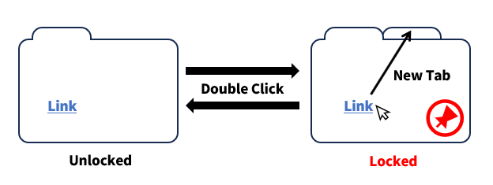

# Double-click to page lock

## What's this?

chrome-extension

## Description
Double-clicking on the margins of a web page toggles the locked state. If locked, open the link in a new tab.

1. Double-click on the margins of the web page.
2. A lock symbol appears in the lower right corner.
3. Click on the link.
4. The link will open in a new tab.

** It may not work on some web pages.

## License

This software is released under the MIT License, see the [LICENSE](./LICENSE).
